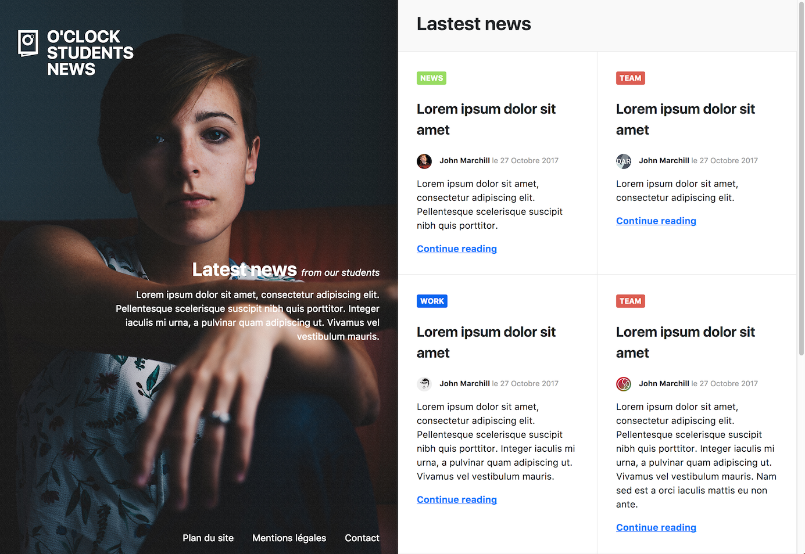

# oNews

O'Clock sort son journal d'étudiants :muscle:

Votre mission, si vous l'acceptez (...pfff évidemment qu'on l'accepte ), sera d'intégrer la maquette du site.

## Infos

- il n'y a qu'une seule page à monter
- la partie de gauche ne bouge pas même si on fait défiler la page vers le bas pour voir les 2 articles suivants

## Charte

### Visuels

Le dossier `images` contient tous les visuels nécessaires pour cette intégration.

### Couleurs

- fond header : #f9f9f9
- bordure d'article : #eaeaea
- WORK : #0766F0;
- TEAM : #DC5E53;
- NEWS : #98DC62;

### Font

Choix libre mais de type sans-serif

## Informations additionnelles

- Les deux parties (portrait et grille d'articles) sont sur une seule et même page
- L'image de la partie de gauche touche les bords supérieur, inférieur et gauche du navigateur. Elle est fixe
- la page contient en tout 6 articles, même si seuls 4 sont visibles
- On peut scroller sur la partie droite (la liste d'articles)
- n'oubliez pas de mettre un effet lors du survol des liens par la souris :wink:
- un fichier _SVG_ est une image vectorielle, voir [MDN sur SVG](https://developer.mozilla.org/fr/docs/Web/SVG)
- si possible, placer le logo SVG en background :wink:

## Git

- il ne faut pas oublier d'enregistrer ses modifications (versions) avec **git**
- il est préférable de le faire à chaque fonctionnalité terminée (par exemple, une fois la partie de gauche terminée => sauvegarde)
- rappel des commandes **git** :
  - fiche récap https://github.com/O-clock-Alumni/fiches-recap/blob/master/ldc/git.md#utiliser-git
  - schéma étapes https://skylabcoders.github.io/bootcamp-winter2017/img/git-schema-1.png
  - `git add .` pour ajouter tous les fichiers ajoutés/modifiés au prochain commit
  - `git commit -m "message explicite expliquant les modifs effectuées"` pour sauvegarder la version actuelle des fichiers sources
